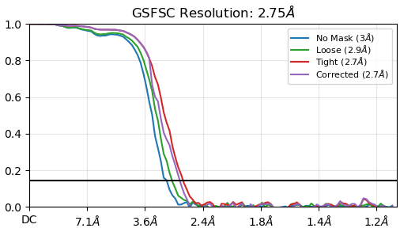
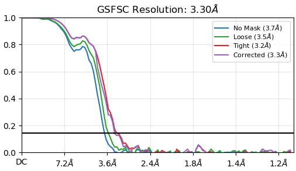
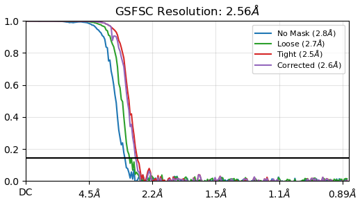
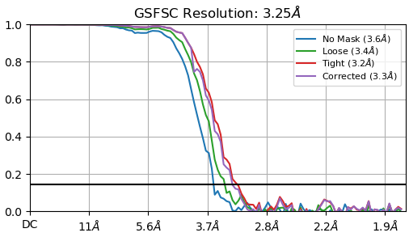
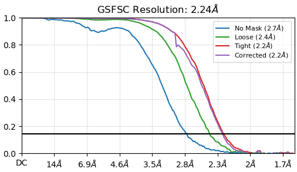
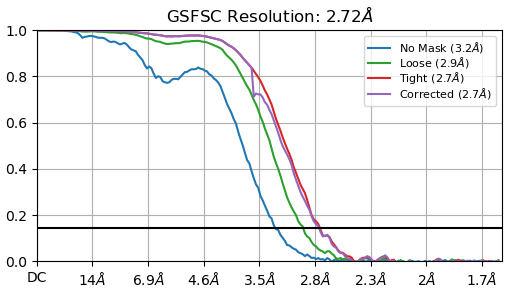
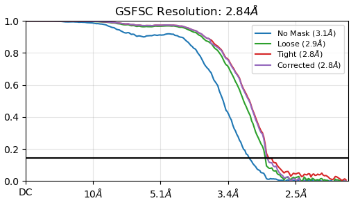
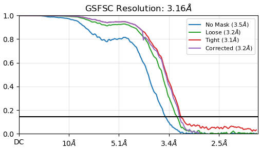
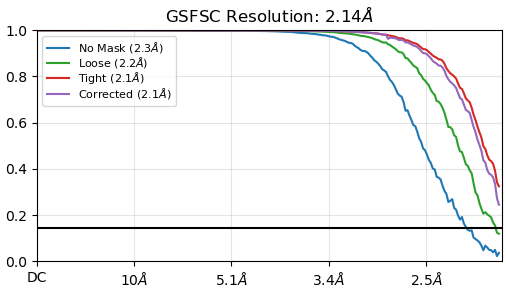
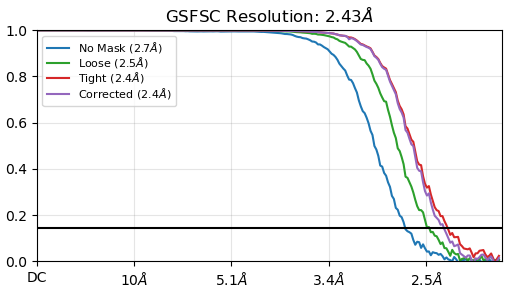

# CryoWizard: a fully automated single-particle cryo-EM data processing pipeline.


[](https://doi.org/10.1038/s41592-025-02916-8)
[](https://huggingface.co/westlake-repl/Cryo-IEF)


CryoWizard is a fully automated single-particle Cryo-EM data processing software. It streamlines the workflow from raw movies, micrographs, or particles to high-resolution 3D volumes. The entire process requires zero human intervention, needing only the input files and a few basic parameters to begin.

Please cite the following paper if this work is useful for your research:

```
@article{yan2025comprehensive,
  title={A comprehensive foundation model for cryo-EM image processing},
  author={Yan, Yang and Fan, Shiqi and Yuan, Fajie and Shen, Huaizong},
  journal={Nature Methods},
  pages={1--8},
  year={2025},
  publisher={Nature Publishing Group US New York}
}
```

CryoWizard is intended for **academic research** only. Commercial use is prohibited without explicit permission.


## Installation

Setting up CryoWizard only takes a few simple steps! However, please take note of the following requirements before you begin:

 - **CryoSPARC Integration**: CryoWizard is designed to build and manage pipelines through [CryoSPARC](https://cryosparc.com/). Please ensure that CryoSPARC is already installed and configured on your cluster.
 - **Version Compatibility**:
   - **Recommended**: We strongly recommend **CryoSPARC v4.5 or higher**. Versions older than 4.5 may lead to unexpected errors.
   - **Note on v4.7**: While a few specialized features require **v4.7**, the vast majority of users will not need these for standard workflows. Therefore, **v4.5 is perfectly sufficient** for a full and smooth experience.
   - **Note on v5.0**: As **CryoSPARC v5.0** is currently in beta, for now, we are not providing official support or optimization for it.
 - **File permission**: Since the use of CryoWizard requires reading and writing files in the Project created by CryoSPARC, we strongly recommend installing with a Linux user account that has the permission to read and write the CryoSPARC Project.
> **Note**: Any features specifically dependent on v4.7 are clearly marked in the [Documentation](#Documentation) section at the end of this page.

### Step 1: Conda Environment Setup

The environment can be configured using `pip` with the`requirements.txt` file:

    (base) $ conda create --name cryowizard python=3.10
    (base) $ conda activate cryowizard
    (cryowizard) $ cd path/to/CryoWizard
    (cryowizard) $ pip install -r requirements.txt

Installation may take several minutes. Subsequently, `cryosparc-tools` must be installed separately to ensure its version matches your CryoSPARC software. Please identify your CryoSPARC version and install the `cryosparc-tools` version that is closest to, and not exceeding, it.

For example, if your CryoSPARC version is 4.6.2, execute:
    
    (cryowizard) $ pip install cryosparc-tools==999.999.999

You will get two ERROR messages like this:

    ERROR: Could not find a version that satisfies the requirement cryosparc-tools==999.999.999
    (from versions: 0.0.3, 4.1.0, 4.1.1, 4.1.2, 4.1.3, 4.2.0, 4.3.0, 4.3.1, 4.4.0, 4.4.1, 4.5.0, 4.5.1, 4.6.0, 4.6.1, 4.7.0)
    ERROR: No matching distribution found for cryosparc-tools==999.999.999

From the error output, identify the closest `cryosparc-tools` version (less than or equal to your CryoSPARC version), and then install it using the following command:

    (cryowizard) $ pip install cryosparc-tools==4.6.1

Upon successful execution, the Conda environment setup will be complete.

### Step 2: Download Model Weights

Some of CryoWizard's features are powered by deep learning models, which require downloading pre-trained weights separately. Looking ahead, we plan to progressively integrate our latest research and new algorithms into CryoWizard to further enhance its capabilities.

- CryoRanker: [https://huggingface.co/westlake-repl/Cryo-IEF](https://huggingface.co/westlake-repl/Cryo-IEF/tree/main/cryo_ranker_checkpoint)

> Our models are intended for **academic research** only. Commercial use is prohibited without explicit permission.

### Step 3: Run Installation Progress

Now, simply run one last command to initialize CryoWizard, and you are all set!

    (base) $ conda activate cryowizard
    (cryowizard) $ cd path/to/CryoWizard
    (cryowizard) $ python CryoWizard.py \
        --CryoWizardInstall \
        --cryosparc_username 'your_cryosparc_username' \
        --cryosparc_password 'your_cryosparc_password' \
        --cryosparc_license 'XXXXXXXX-XXXX-XXXX-XXXX-XXXXXXXXXXXX' \
        --cryosparc_hostname your_cryosparc_master_host_name \
        --cryosparc_port your_cryosparc_master_port \
        --cryosparc_lane your_cryosparc_lane_name_to_run_CryoSPARC_jobs \
        --cryoranker_model_weight 'path/to/your/downloaded/cryo_ranker_model_weight_folder' \
        --slurm yes/no (optional, see Step 4)

### Step 4 (optional): Run model inference on Slurm

CryoWizard process will automatically queue CryoSPARC jobs during running, and these jobs will run on CryoSPARC lanes. However, the model inference task could not use GPUs on CryoSPARC lanes, and it will perform the inference task on current node (the command execution or the web/extension server application launching node). Please make sure there are GPUs available here.

Of course, you also can use Slurm to run your model inference task during CryoWizard running. If you want that CryoWizard would submit model inference tasks with [Slurm](https://slurm.schedmd.com/) automatically during running, there are two ways to set:

- Global setting, after modifying this, all CryoWizard process will use this setting: Set `--slurm` parameter to `yes` when running `Step 3`. Then, modify header settings in `path/to/CryoWizard/CryoWizard/parameters/SlurmHeader.sh`, and CryoWizard will using these header settings to run model inference task on slurm. Please note that **do NOT** set `#SBATCH -o` and `#SBATCH -e` parameters in `SlurmHeader.sh`, CryoWizard would set these two settings during running automatically.
- Case by case setting, Set `if_slurm` to `true` in `path/to/single/cryowizard_job_folder/cryowizard/parameters/base_parameters/parameters.json` every time after creating base parameters, then modify header settings in `path/to/single/cryowizard_job_folder/cryowizard/parameters/base_parameters/SlurmHeader.sh`. Please note that **do NOT** set `#SBATCH -o` and `#SBATCH -e` parameters in `SlurmHeader.sh`, CryoWizard would set these two settings during running automatically. 

> **Caution**: Case by case settings are unavailable when using the CryoWizard Chrome Extension. In this workflow, parameter creation and process execution are bundled together, so users cannot intercept or modify the parameter file before the run starts.

And please make sure that slurm is installed on your server.


## Quick start

[CryoWizard Quick Start](./readmes/quick_start/README.md)


## Documentation


### Use CryoWizard via Chrome Extension

Doc: [CryoWizard Chrome Extension](readmes/CryoWizard_crx/README.md)

### Use CryoWizard via Web Interface

Doc: [CryoWizard Web Interface](readmes/CryoWizard_web/README.md)

### Use CryoWizard via Command

Doc: [CryoWizard Command](readmes/CryoWizard_cmd/README.md)

### More Settings

Doc: [CryoWizard Optional Settions](readmes/CryoWizard_opt/README.md)


## Updata log

### v1.5

**v1.5 CryoWizard Improvements**:

All tests for CryoWizard v1.5 were conducted using the `default` preset pipeline type.

|                                                                                         |                                                        v1.5                                                        |                                                        v1.0                                                         | Author-deposited resolution |
|-----------------------------------------------------------------------------------------|:------------------------------------------------------------------------------------------------------------------:|:-------------------------------------------------------------------------------------------------------------------:|:---------------------------:|
| EMPIAR-10250 <br> (63.37 kDa)                                                           | 2.75 A <br>  | 3.3 A <br>   |        2.8 A / 3.2 A        |
| EMPIAR-10405 <br> (510.47 kDa) <br> (CryoWizard v1.5 only used 596 of total 743 movies) | 2.56 A <br>  | 3.25 A <br>  |            2.6 A            |
| EMPIAR-10556 <br> (709.09 kDa)                                                          | 2.24 A <br>  | 2.72 A <br>   |           1.95 A            |
| EMPIAR-10454 <br> (2714.05 kDa)                                                         | 2.84 A <br>  | 3.16 A <br>  |            2.8 A            |
| EMPIAR-10983 <br> (6864.6 kDa, Virus)                                                   | 2.14 A <br>  | 2.43 A <br>  |            2.8 A            |
> Molecular weight data source: [https://www.rcsb.org/](https://www.rcsb.org/)

- **2026.2.22**: We have refactored the code architecture of CryoWizard, making pipeline construction significantly more flexible. Additionally, the user interface and entry points have been unified into `CryoWizard.py`

  


