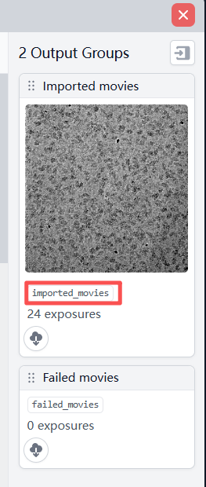

# Use CryoWizard via Command

## Create CryoWizard Job

To use CryoWizard, you first need to create a valid CryoWizard job. This job serves as a container for all configuration parameters and runtime output data.

**Command**:

    (cryowizard) $ python CryoWizard.py \
        --CreateCryoWizardJob \
        --cryosparc_username 'your_cryosparc_username' \
        --cryosparc_password 'your_cryosparc_password' \
        --cryosparc_project P1 \
        --cryosparc_workspace W1
    
    # --CreateCryoWizardJob: Use to create a new CryoWizard job
    # --cryosparc_username: Your username to log in CryoSPARC
    # --cryosparc_password: Your password to log in CryoSPARC
    # --cryosparc_project: Which CryoSPARC project you want to create a new CryoWizard job
    # --cryosparc_workspace: Which CryoSPARC workspace you want to create a new CryoWizard job

## Create Parameters

After creating a CryoWizard job, you need to generate a series of parameter files. While Base Parameters are mandatory, each of the other parameter types represents a specific pipeline block type. Therefore, you can create one or more instances of these other types according to your specific pipeline workflow requirements to build your pipeline.
    
**Parameter type**:

- **base_parameters**: A mandatory component for every CryoWizard job used to store common pipeline configurations (e.g., CryoSPARC lane, Slurm usage), no output.
- **import_movie_file_parameters**: Import movie files, output types: movie
- **import_micrograph_file_parameters**: Import micrograph files, output types: micrograph
- **import_particle_file_parameters**: Import particle files, output types: particle
- **import_volume_file_parameters**: Import single volume/mask file, output types: volume/mask
- **preprocess_movie_with_blob_pick_parameters**: Preprocess movie jobs to particles with blob picker, output types: movie, micrograph, particle, template
- **preprocess_movie_with_template_pick_parameters**: Preprocess movie jobs to particles with template picker, output types: movie, micrograph, particle, template
- **preprocess_micrograph_with_blob_pick_parameters**: Preprocess micrograph jobs to particles with blob picker, output types: micrograph, particle, template
- **preprocess_micrograph_with_template_pick_parameters**: Preprocess micrograph jobs to particles with template picker, output types: micrograph, particle, template
- **preprocess_particle_parameters**: Preprocess particles, output types: particle
- **create_templates_parameters**: Create templates from single volume, if multiple volumes exsit in the input, it will use the first one, output types: template
- **reference_based_auto_select_2d**: (**Need CryoSPARC version 4.7+**) Doing 2D Classification and use reference volume to select classes, if multiple volumes exsit in the input, it will use the first one, output types: particle, template, volume
- **junk_detector**: (**Need CryoSPARC version 4.7+**) Use CryoSPARC junk detector to delete particles, these particles should have picking info, output type: micrograph, particle
- **cryoranker_parameters**: Create CryoRanker inference job, output types: particle, ranker
- **get_top_particles**: Get top particles from CryoRanker jobs, output types: particle, ranker
- **refine_parameters**: Use CryoRanker jobs to run multiple refine jobs, for finding best number of particles to get final 3D volume, output types: particle, volume, mask
- **motion_and_ctf_refine_parameters**: Do motion refine and global/local ctf refine, output types: particle, volume, mask

**Command**:

    (cryowizard) $ python CryoWizard.py \
        --CreateParameterFiles \
        --parameter_type base_parameters \
        --cryosparc_username 'your_cryosparc_username' \
        --cryosparc_password 'your_cryosparc_password' \
        --cryosparc_project P1 \
        --cryowizard_job_uid J1

    # --CreateParameterFiles: Use to create parameter files
    # --parameter_type: Which type of parameters you want to create 
    # --cryosparc_username: Your username to log in CryoSPARC
    # --cryosparc_password: Your password to log in CryoSPARC
    # --cryosparc_project: The CryoSPARC project where the CryoWizard job is in
    # --cryowizard_job_uid: The CryoWizard job you want to use

## Modify Parameters

Once the parameter file creation is complete, the program will output the name of the new parameter folder (e.g., `"Create parameters done, new parameter folder name: preprocess_0"`). After creating these files, the next step is to modify them. Please note that different parameter files accept different sets of parameters.

> **Caution**: Generally, you only need to enter the CryoSPARC Job ID in the jobs input field. CryoWizard will automatically identify the best matching output from that job to use as its input. However, if the job contains multiple similar outputs (for example, a "Particle Sets Tool" job may have split 0, split 1, etc.), CryoWizard might fetch the incorrect one due to ambiguity. In such cases, we recommend using the format "Job ID + underscore + target output group name" (e.g., J1_imported_movies, as shown in the figure above). You can find the specific output group name in the Output Groups section of the CryoSPARC job (as shown in the figure below). Additionally, we support specifying inputs by the pipeline block name (e.g., preprocess_0). However, you must ensure that the referenced pipeline block generates an output of the corresponding type.
   

**1. base_parameters**

**Command**:

    (cryowizard) $ python CryoWizard.py \
        --ModifyParameterFiles \
        --parameter_folder_name base_parameters \
        --cryosparc_username 'your_cryosparc_username' \
        --cryosparc_password 'your_cryosparc_password' \
        --cryosparc_project P1 \
        --cryosparc_workspace W1 \
        --cryowizard_job_uid J1 \
        --cryosparc_lane default \
        --slurm yes \
        --inference_gpu_ids '0,1'

    # --ModifyParameterFiles: Use to modify parameters
    # --parameter_folder_name: Which parameter folder you want to modify parameters 
    # --cryosparc_username: Your username to log in CryoSPARC
    # --cryosparc_password: Your password to log in CryoSPARC
    # --cryosparc_project: Which CryoSPARC project you want to create CryoSPARC jobs
    # --cryosparc_workspace: Which CryoSPARC workspace you want to create CryoSPARC jobs
    # --cryowizard_job_uid: The CryoWizard job you want to use
    # --cryosparc_lane: (Optional) Which CryoSPARC lane to queue CryoSPARC jobs during running.
    # --slurm: (Optional) Whether run model inference on Slurm or not, set this parameter to true/True/yes/Yes/y/Y to enable the option or set it to false/False/no/No/n/N to disable it.
    # --inference_gpu_ids: (Optional) If model inference (e.g., CryoRanker) is running locally rather than being submitted via Slurm, you can use this parameter to specify which GPUs to use. For example, entering '0,1' will allocate GPU 0 and GPU 1.

**2. import_movie_file_parameters**

**Command**:

    (cryowizard) $ python CryoWizard.py \
        --ModifyParameterFiles \
        --parameter_folder_name import_0 \
        --cryosparc_username 'your_cryosparc_username' \
        --cryosparc_password 'your_cryosparc_password' \
        --cryosparc_project P1 \
        --cryowizard_job_uid J1 \
        --movies_data_path '/path/to/movie/files' \
        --gain_reference_path '/path/to/gain_reference_files' \
        --raw_pixel_size 1.06 \
        --accelerating_voltage 300 \
        --spherical_aberration 2.7 \
        --total_exposure_dose 50.0

    # --ModifyParameterFiles: Use to modify parameters
    # --parameter_folder_name: Which parameter folder you want to modify parameters 
    # --cryosparc_username: Your username to log in CryoSPARC
    # --cryosparc_password: Your password to log in CryoSPARC
    # --cryosparc_project: The CryoSPARC project where the CryoWizard job is in
    # --cryowizard_job_uid: The CryoWizard job you want to use
    # --movies_data_path: Movie files data path
    # --gain_reference_path: (Optional) Gain reference file data path
    # --raw_pixel_size: Raw pixel size
    # --accelerating_voltage: Accelerating Voltage
    # --spherical_aberration: Spherical Aberration
    # --total_exposure_dose: Total exposure dose

**3. import_micrograph_file_parameters**

**Command**:

    (cryowizard) $ python CryoWizard.py \
        --ModifyParameterFiles \
        --parameter_folder_name import_1 \
        --cryosparc_username 'your_cryosparc_username' \
        --cryosparc_password 'your_cryosparc_password' \
        --cryosparc_project P1 \
        --cryowizard_job_uid J1 \
        --micrographs_data_path '/path/to/micrograph/files' \
        --raw_pixel_size 1.06 \
        --accelerating_voltage 300 \
        --spherical_aberration 2.7 \
        --total_exposure_dose 50.0

    # --ModifyParameterFiles: Use to modify parameters
    # --parameter_folder_name: Which parameter folder you want to modify parameters 
    # --cryosparc_username: Your username to log in CryoSPARC
    # --cryosparc_password: Your password to log in CryoSPARC
    # --cryosparc_project: The CryoSPARC project where the CryoWizard job is in
    # --cryowizard_job_uid: The CryoWizard job you want to use
    # --micrographs_data_path: Micrograph files data path
    # --raw_pixel_size: Raw pixel size
    # --accelerating_voltage: Accelerating Voltage
    # --spherical_aberration: Spherical Aberration
    # --total_exposure_dose: Total exposure dose

**4. import_particle_file_parameters**

**Command**:

    (cryowizard) $ python CryoWizard.py \
        --ModifyParameterFiles \
        --parameter_folder_name import_2 \
        --cryosparc_username 'your_cryosparc_username' \
        --cryosparc_password 'your_cryosparc_password' \
        --cryosparc_project P1 \
        --cryowizard_job_uid J1 \
        --particles_data_path '/path/to/particle/mrc/files' \
        --particles_meta_path '/path/to/particle/meta/files'

    # --ModifyParameterFiles: Use to modify parameters
    # --parameter_folder_name: Which parameter folder you want to modify parameters 
    # --cryosparc_username: Your username to log in CryoSPARC
    # --cryosparc_password: Your password to log in CryoSPARC
    # --cryosparc_project: The CryoSPARC project where the CryoWizard job is in
    # --cryowizard_job_uid: The CryoWizard job you want to use
    # --particles_data_path: (Optional) Particle files data path
    # --particles_meta_path: (Optional) Particle metadata files path

**5. import_volume_file_parameters**

**Command**:

    (cryowizard) $ python CryoWizard.py \
        --ModifyParameterFiles \
        --parameter_folder_name import_3 \
        --cryosparc_username 'your_cryosparc_username' \
        --cryosparc_password 'your_cryosparc_password' \
        --cryosparc_project P1 \
        --cryowizard_job_uid J1 \
        --volume_data_path /path/to/3d/volume/file \
        --volume_import_type 'map' \
        --volume_emdb_id 0001 \
        --volume_pixelsize 1.0

    # --ModifyParameterFiles: Use to modify parameters
    # --parameter_folder_name: Which parameter folder you want to modify parameters 
    # --cryosparc_username: Your username to log in CryoSPARC
    # --cryosparc_password: Your password to log in CryoSPARC
    # --cryosparc_project: The CryoSPARC project where the CryoWizard job is in
    # --cryowizard_job_uid: The CryoWizard job you want to use
    # --volume_data_path: (Optional) Volume file data path
    # --volume_import_type: (Optional) map/map_sharp/mask
    # --volume_emdb_id: (Optional) Volume EMDB Id
    # --volume_pixelsize: (Optional) Volume pixel size

**6. preprocess_movie_with_blob_pick_parameters**

**Command**:

    (cryowizard) $ python CryoWizard.py \
        --ModifyParameterFiles \
        --parameter_folder_name preprocess_0 \
        --cryosparc_username 'your_cryosparc_username' \
        --cryosparc_password 'your_cryosparc_password' \
        --cryosparc_project P1 \
        --cryowizard_job_uid J1 \
        --source_movie_job_uid import_0 \
        --raw_pixel_size 0.885 \
        --particle_diameter 160 \
        --ctf_fit_resolution '0,8' \
        --gpu_num 2

    # --ModifyParameterFiles: Use to modify parameters
    # --parameter_folder_name: Which parameter folder you want to modify parameters 
    # --cryosparc_username: Your username to log in CryoSPARC
    # --cryosparc_password: Your password to log in CryoSPARC
    # --cryosparc_project: The CryoSPARC project where the CryoWizard job is in
    # --cryowizard_job_uid: The CryoWizard job you want to use
    # --source_movie_job_uid: Input movie jobs id, multiple Job IDs should be space-separated.
    # --raw_pixel_size: Raw pixel size
    # --particle_diameter: Average Particle diameter
    # --ctf_fit_resolution: (Optional) CTF fit resolution
    # --gpu_num: (Optional) Number of GPUs for Multi-GPU CryoSPARC jobs

**7. preprocess_movie_with_template_pick_parameters**

**Command**:

    (cryowizard) $ python CryoWizard.py \
        --ModifyParameterFiles \
        --parameter_folder_name preprocess_1 \
        --cryosparc_username 'your_cryosparc_username' \
        --cryosparc_password 'your_cryosparc_password' \
        --cryosparc_project P1 \
        --cryowizard_job_uid J1 \
        --source_movie_job_uid import_0 \
        --source_template_job_uid J2_templates \
        --raw_pixel_size 0.885 \
        --particle_diameter 160 \
        --ctf_fit_resolution '0,8' \
        --gpu_num 2

    # --ModifyParameterFiles: Use to modify parameters
    # --parameter_folder_name: Which parameter folder you want to modify parameters 
    # --cryosparc_username: Your username to log in CryoSPARC
    # --cryosparc_password: Your password to log in CryoSPARC
    # --cryosparc_project: The CryoSPARC project where the CryoWizard job is in
    # --cryowizard_job_uid: The CryoWizard job you want to use
    # --source_movie_job_uid: Input movie jobs id, multiple Job IDs should be space-separated.
    # --source_template_job_uid: Input template jobs id, multiple Job IDs should be space-separated.
    # --raw_pixel_size: Raw pixel size
    # --particle_diameter: Average Particle diameter
    # --ctf_fit_resolution: (Optional) CTF fit resolution
    # --gpu_num: (Optional) Number of GPUs for Multi-GPU CryoSPARC jobs

**8. preprocess_micrograph_with_blob_pick_parameters**

**Command**:

    (cryowizard) $ python CryoWizard.py \
        --ModifyParameterFiles \
        --parameter_folder_name preprocess_2 \
        --cryosparc_username 'your_cryosparc_username' \
        --cryosparc_password 'your_cryosparc_password' \
        --cryosparc_project P1 \
        --cryowizard_job_uid J1 \
        --source_micrograph_job_uid import_1 \
        --raw_pixel_size 0.885 \
        --particle_diameter 160 \
        --ctf_fit_resolution '0,8' \
        --gpu_num 2

    # --ModifyParameterFiles: Use to modify parameters
    # --parameter_folder_name: Which parameter folder you want to modify parameters 
    # --cryosparc_username: Your username to log in CryoSPARC
    # --cryosparc_password: Your password to log in CryoSPARC
    # --cryosparc_project: The CryoSPARC project where the CryoWizard job is in
    # --cryowizard_job_uid: The CryoWizard job you want to use
    # --source_micrograph_job_uid: Input micrograph jobs id, multiple Job IDs should be space-separated.
    # --raw_pixel_size: Raw pixel size
    # --particle_diameter: Average Particle diameter
    # --ctf_fit_resolution: (Optional) CTF fit resolution
    # --gpu_num: (Optional) Number of GPUs for Multi-GPU CryoSPARC jobs

**9. preprocess_micrograph_with_template_pick_parameters**

**Command**:

    (cryowizard) $ python CryoWizard.py \
        --ModifyParameterFiles \
        --parameter_folder_name preprocess_3 \
        --cryosparc_username 'your_cryosparc_username' \
        --cryosparc_password 'your_cryosparc_password' \
        --cryosparc_project P1 \
        --cryowizard_job_uid J1 \
        --source_micrograph_job_uid import_1 \
        --source_template_job_uid J2_templates \
        --raw_pixel_size 0.885 \
        --particle_diameter 160 \
        --ctf_fit_resolution '0,8' \
        --gpu_num 2

    # --ModifyParameterFiles: Use to modify parameters
    # --parameter_folder_name: Which parameter folder you want to modify parameters 
    # --cryosparc_username: Your username to log in CryoSPARC
    # --cryosparc_password: Your password to log in CryoSPARC
    # --cryosparc_project: The CryoSPARC project where the CryoWizard job is in
    # --cryowizard_job_uid: The CryoWizard job you want to use
    # --source_micrograph_job_uid: Input micrograph jobs id, multiple Job IDs should be space-separated.
    # --source_template_job_uid: Input template jobs id, multiple Job IDs should be space-separated.
    # --raw_pixel_size: Raw pixel size
    # --particle_diameter: Average Particle diameter
    # --ctf_fit_resolution: (Optional) CTF fit resolution
    # --gpu_num: (Optional) Number of GPUs for Multi-GPU CryoSPARC jobs

**10. preprocess_particle_parameters**

**Command**:

    (cryowizard) $ python CryoWizard.py \
        --ModifyParameterFiles \
        --parameter_folder_name preprocess_4 \
        --cryosparc_username 'your_cryosparc_username' \
        --cryosparc_password 'your_cryosparc_password' \
        --cryosparc_project P1 \
        --cryowizard_job_uid J1 \
        --source_particle_job_uid import_2

    # --ModifyParameterFiles: Use to modify parameters
    # --parameter_folder_name: Which parameter folder you want to modify parameters 
    # --cryosparc_username: Your username to log in CryoSPARC
    # --cryosparc_password: Your password to log in CryoSPARC
    # --cryosparc_project: The CryoSPARC project where the CryoWizard job is in
    # --cryowizard_job_uid: The CryoWizard job you want to use
    # --source_particle_job_uid: Input particle jobs id, multiple Job IDs should be space-separated.

**11. create_templates_parameters**

**Command**:

    (cryowizard) $ python CryoWizard.py \
        --ModifyParameterFiles \
        --parameter_folder_name preprocess_5 \
        --cryosparc_username 'your_cryosparc_username' \
        --cryosparc_password 'your_cryosparc_password' \
        --cryosparc_project P1 \
        --cryowizard_job_uid J1 \
        --source_volume_job_uid import_3

    # --ModifyParameterFiles: Use to modify parameters
    # --parameter_folder_name: Which parameter folder you want to modify parameters 
    # --cryosparc_username: Your username to log in CryoSPARC
    # --cryosparc_password: Your password to log in CryoSPARC
    # --cryosparc_project: The CryoSPARC project where the CryoWizard job is in
    # --cryowizard_job_uid: The CryoWizard job you want to use
    # --source_volume_job_uid: Input volume jobs id, multiple Job IDs should be space-separated.

**12. reference_based_auto_select_2d**

**Command**:

    (cryowizard) $ python CryoWizard.py \
        --ModifyParameterFiles \
        --parameter_folder_name preprocess_6 \
        --cryosparc_username 'your_cryosparc_username' \
        --cryosparc_password 'your_cryosparc_password' \
        --cryosparc_project P1 \
        --cryowizard_job_uid J1 \
        --source_particle_job_uid import_2 \
        --source_volume_job_uid import_3 \
        --gpu_num 2

    # --ModifyParameterFiles: Use to modify parameters
    # --parameter_folder_name: Which parameter folder you want to modify parameters 
    # --cryosparc_username: Your username to log in CryoSPARC
    # --cryosparc_password: Your password to log in CryoSPARC
    # --cryosparc_project: The CryoSPARC project where the CryoWizard job is in
    # --cryowizard_job_uid: The CryoWizard job you want to use
    # --source_particle_job_uid: Input particle jobs id, multiple Job IDs should be space-separated.
    # --source_volume_job_uid: Input volume jobs id, multiple Job IDs should be space-separated.
    # --gpu_num: (Optional) Number of GPUs for Multi-GPU CryoSPARC jobs

**13. junk_detector**

**Command**:

    (cryowizard) $ python CryoWizard.py \
        --ModifyParameterFiles \
        --parameter_folder_name preprocess_7 \
        --cryosparc_username 'your_cryosparc_username' \
        --cryosparc_password 'your_cryosparc_password' \
        --cryosparc_project P1 \
        --cryowizard_job_uid J1 \
        --source_particle_job_uid preprocess_0

    # --ModifyParameterFiles: Use to modify parameters
    # --parameter_folder_name: Which parameter folder you want to modify parameters 
    # --cryosparc_username: Your username to log in CryoSPARC
    # --cryosparc_password: Your password to log in CryoSPARC
    # --cryosparc_project: The CryoSPARC project where the CryoWizard job is in
    # --cryowizard_job_uid: The CryoWizard job you want to use
    # --source_particle_job_uid: Input particle jobs id, multiple Job IDs should be space-separated.

**14. cryoranker_parameters**

**Command**:

    (cryowizard) $ python CryoWizard.py \
        --ModifyParameterFiles \
        --parameter_folder_name cryoranker_0 \
        --cryosparc_username 'your_cryosparc_username' \
        --cryosparc_password 'your_cryosparc_password' \
        --cryosparc_project P1 \
        --cryowizard_job_uid J1 \
        --source_particle_job_uid preprocess_0

    # --ModifyParameterFiles: Use to modify parameters
    # --parameter_folder_name: Which parameter folder you want to modify parameters 
    # --cryosparc_username: Your username to log in CryoSPARC
    # --cryosparc_password: Your password to log in CryoSPARC
    # --cryosparc_project: The CryoSPARC project where the CryoWizard job is in
    # --cryowizard_job_uid: The CryoWizard job you want to use
    # --source_particle_job_uid: Input particle jobs id, multiple Job IDs should be space-separated.

**15. get_top_particles**

**Command**:

    (cryowizard) $ python CryoWizard.py \
        --ModifyParameterFiles \
        --parameter_folder_name cryoranker_1 \
        --cryosparc_username 'your_cryosparc_username' \
        --cryosparc_password 'your_cryosparc_password' \
        --cryosparc_project P1 \
        --cryowizard_job_uid J1 \
        --source_cryoranker_job_uid cryoranker_0 \
        --get_top_particles_num 3000 \
        --get_top_particles_score 0.6

    # --ModifyParameterFiles: Use to modify parameters
    # --parameter_folder_name: Which parameter folder you want to modify parameters 
    # --cryosparc_username: Your username to log in CryoSPARC
    # --cryosparc_password: Your password to log in CryoSPARC
    # --cryosparc_project: The CryoSPARC project where the CryoWizard job is in
    # --cryowizard_job_uid: The CryoWizard job you want to use
    # --source_cryoranker_job_uid: Input CryoRanker jobs id, multiple Job IDs should be space-separated.
    # --get_top_particles_num: (Use either --get_top_particles_score or this one) If want get top particles by particle number, set this parameter
    # --get_top_particles_score: (Use either --get_top_particles_num or this one) If want get top particles by particle min score, set this parameter (Score range: 0-1)

**16. refine_parameters**

**Command**:

    (cryowizard) $ python CryoWizard.py \
        --ModifyParameterFiles \
        --parameter_folder_name refine_0 \
        --cryosparc_username 'your_cryosparc_username' \
        --cryosparc_password 'your_cryosparc_password' \
        --cryosparc_project P1 \
        --cryowizard_job_uid J1 \
        --source_cryoranker_job_uid cryoranker_0 \
        --symmetry D2

    # --ModifyParameterFiles: Use to modify parameters
    # --parameter_folder_name: Which parameter folder you want to modify parameters 
    # --cryosparc_username: Your username to log in CryoSPARC
    # --cryosparc_password: Your password to log in CryoSPARC
    # --cryosparc_project: The CryoSPARC project where the CryoWizard job is in
    # --cryowizard_job_uid: The CryoWizard job you want to use
    # --source_particle_job_uid: Input particle jobs id, multiple Job IDs should be space-separated.
    # --source_cryoranker_job_uid: Input CryoRanker jobs id, multiple Job IDs should be space-separated.
    # --symmetry: (Optional) Protein symmetry

**17. motion_and_ctf_refine_parameters**

**Command**:

    (cryowizard) $ python CryoWizard.py \
        --ModifyParameterFiles \
        --parameter_folder_name postprocess_0 \
        --cryosparc_username 'your_cryosparc_username' \
        --cryosparc_password 'your_cryosparc_password' \
        --cryosparc_project P1 \
        --cryowizard_job_uid J1 \
        --source_particle_job_uid refine_0 \
        --source_volume_job_uid refine_0 \
        --source_mask_job_uid refine_0 \
        --symmetry D2 \
        --gpu_num 2

    # --ModifyParameterFiles: Use to modify parameters
    # --parameter_folder_name: Which parameter folder you want to modify parameters 
    # --cryosparc_username: Your username to log in CryoSPARC
    # --cryosparc_password: Your password to log in CryoSPARC
    # --cryosparc_project: The CryoSPARC project where the CryoWizard job is in
    # --cryowizard_job_uid: The CryoWizard job you want to use
    # --source_particle_job_uid: Input particle jobs id, multiple Job IDs should be space-separated.
    # --source_volume_job_uid: Input volume jobs id, multiple Job IDs should be space-separated.
    # --source_mask_job_uid: (Optional) Input mask jobs id, multiple Job IDs should be space-separated.
    # --symmetry: (Optional) Protein symmetry
    # --gpu_num: (Optional) Number of GPUs for Multi-GPU CryoSPARC jobs

## Make CryoWizard Pipeline

Once all parameters are modified, you can construct the pipeline. CryoWizard automatically strings the blocks into a logical sequence based on the input settings of each block. However, please note that there must be no circular dependencies between blocks (e.g., Block A cannot require Block B as an input if Block B also requires Block A). The pipeline must be a Directed Acyclic Graph (DAG).

**Command**:

    (cryowizard) $ python CryoWizard.py \
        --MakePipeline \
        --cryosparc_username 'your_cryosparc_username' \
        --cryosparc_password 'your_cryosparc_password' \
        --cryosparc_project P1 \
        --cryowizard_job_uid J1

    # --MakePipeline: Use to auto make pipeline
    # --cryosparc_username: Your username to log in CryoSPARC
    # --cryosparc_password: Your password to log in CryoSPARC
    # --cryosparc_project: The CryoSPARC project where the CryoWizard job is in
    # --cryowizard_job_uid: The CryoWizard job you want to use

## Make CryoWizard Input Connections

Once the pipeline is created, you can use a command to link all CryoSPARC job-type inputs within the pipeline to the CryoWizard job. This improves visibility, making it easier to track all inputs directly from the CryoSPARC interface.

**Command**:

    (cryowizard) $ python CryoWizard.py \
        --MakeCryoWizardConnections \
        --cryosparc_username 'your_cryosparc_username' \
        --cryosparc_password 'your_cryosparc_password' \
        --cryosparc_project P1 \
        --cryowizard_job_uid J1

    # --MakeCryoWizardConnections: Use to auto make connections
    # --cryosparc_username: Your username to log in CryoSPARC
    # --cryosparc_password: Your password to log in CryoSPARC
    # --cryosparc_project: The CryoSPARC project where the CryoWizard job is in
    # --cryowizard_job_uid: The CryoWizard job you want to use

## Run CryoWizard Pipeline

Once the pipeline is ready, execute the following command to run or continue the CryoWizard pipeline.

**Command**:

    (cryowizard) $ python CryoWizard.py \
        --RunPipeline \
        --cryosparc_username 'your_cryosparc_username' \
        --cryosparc_password 'your_cryosparc_password' \
        --cryosparc_project P1 \
        --cryowizard_job_uid J1

    # --RunPipeline: Use to run/continue CryoWizard pipeline
    # --cryosparc_username: Your username to log in CryoSPARC
    # --cryosparc_password: Your password to log in CryoSPARC
    # --cryosparc_project: The CryoSPARC project where the CryoWizard job is in
    # --cryowizard_job_uid: The CryoWizard job you want to use

## Kill CryoWizard Pipeline

You can stop the CryoWizard pipeline at any time during its execution. Doing so will terminate the pipeline process along with all jobs it has created.

**Command**:

    (cryowizard) $ python CryoWizard.py \
        --KillPipeline \
        --cryosparc_username 'your_cryosparc_username' \
        --cryosparc_password 'your_cryosparc_password' \
        --cryosparc_project P1 \
        --cryowizard_job_uid J1

    # --KillPipeline: Use to kill CryoWizard pipeline and all jobs created by CryoWizard
    # --cryosparc_username: Your username to log in CryoSPARC
    # --cryosparc_password: Your password to log in CryoSPARC
    # --cryosparc_project: The CryoSPARC project where the CryoWizard job is in
    # --cryowizard_job_uid: The CryoWizard job you want to use

## Clear CryoWizard data

This command is used to clean up the parameter data and the metadata generated during the CryoWizard job runtime.

**Command**:

    (cryowizard) $ python CryoWizard.py \
        --ClearAll \
        --cryosparc_username 'your_cryosparc_username' \
        --cryosparc_password 'your_cryosparc_password' \
        --cryosparc_project P1 \
        --cryowizard_job_uid J1 \
        --target_data_name preprocess_0

    # --ClearAll: Use to clear CryoWizard job data
    # --cryosparc_username: Your username to log in CryoSPARC
    # --cryosparc_password: Your password to log in CryoSPARC
    # --cryosparc_project: The CryoSPARC project where the CryoWizard job is in
    # --cryowizard_job_uid: The CryoWizard job you want to use
    # --target_data_name: (Optional) If this parameter is not set, all parameter data and runtime-generated metadata will be deleted. If a specific parameter folder name is provided, only that folder and its corresponding runtime metadata will be removed.

## Clear CryoWizard metadata

This command is used to only clean up the metadata generated during the CryoWizard job runtime.

**Command**:

    (cryowizard) $ python CryoWizard.py \
        --ClearMetadata \
        --cryosparc_username 'your_cryosparc_username' \
        --cryosparc_password 'your_cryosparc_password' \
        --cryosparc_project P1 \
        --cryowizard_job_uid J1 \
        --target_data_name preprocess_0

    # --ClearMetadata: Use to clear CryoWizard job metadata
    # --cryosparc_username: Your username to log in CryoSPARC
    # --cryosparc_password: Your password to log in CryoSPARC
    # --cryosparc_project: The CryoSPARC project where the CryoWizard job is in
    # --cryowizard_job_uid: The CryoWizard job you want to use
    # --target_data_name: (Optional) If this parameter is not set, all runtime-generated metadata will be deleted. If a specific parameter folder name is provided, only that corresponding runtime metadata will be removed.

## Create Preset Pipeline

We also provide several preset pipeline types. After creating a new CryoWizard job, you can choose to create a preset pipeline to automatically complete the entire pre-run workflow in one go. Once created, you can proceed directly to running the pipeline.

**1. default pipeline**

Standard pipeline. It begins with an initial round of particle picking using a Blob Picker, followed by CryoRanker and a few rounds of NU-Refinement to generate a 3D volume. Subsequently, if the input includes movies or micrographs, the pipeline will automatically perform Template Picking on them using the initial 3D volume. All resulting particles then undergo another round of CryoRanker and NU-Refinement to produce a new 3D volume, followed by post-processing for the final result.

**Command**:

    (cryowizard) $ python CryoWizard.py \
        --CreatePresetPipeline \
        --preset_pipeline_type default \
        --cryosparc_username 'your_cryosparc_username' \
        --cryosparc_password 'your_cryosparc_password' \
        --cryosparc_project P1 \
        --cryosparc_workspace W1 \
        --cryowizard_job_uid J1 \
        --cryosparc_lane default \
        --slurm yes \
        --inference_gpu_ids '0,1' \
        --movies_data_path '/path/to/movie/files' \
        --gain_reference_path '/path/to/gain_reference_files' \
        --micrographs_data_path '/path/to/micrograph/files' \
        --particles_data_path '/path/to/particle/mrc/files' \
        --particles_meta_path '/path/to/particle/meta/files' \
        --source_movie_job_uid J5_imported_movies \
        --source_micrograph_job_uid J6_imported_micrographs \
        --source_particle_job_uid J7_particles \
        --raw_pixel_size 1.06 \
        --particle_diameter 160 \
        --accelerating_voltage 300 \
        --spherical_aberration 2.7 \
        --total_exposure_dose 50.0 \
        --ctf_fit_resolution '0,8' \
        --symmetry D2 \
        --gpu_num 2

    # --CreatePresetPipeline: Use to create preset pipeline
    # --preset_pipeline_type: Which type of preset pipeline you want to create 
    # --cryosparc_username: Your username to log in CryoSPARC
    # --cryosparc_password: Your password to log in CryoSPARC
    # --cryosparc_project: Which CryoSPARC project you want to create CryoSPARC jobs
    # --cryosparc_workspace: Which CryoSPARC workspace you want to create CryoSPARC jobs
    # --cryowizard_job_uid: The CryoWizard job you want to use
    # --cryosparc_lane: (Optional) Which CryoSPARC lane to queue CryoSPARC jobs during running.
    # --slurm: (Optional) Whether run model inference on Slurm or not, set this parameter to true/True/yes/Yes/y/Y to enable the option or set it to false/False/no/No/n/N to disable it.
    # --inference_gpu_ids: (Optional) If model inference (e.g., CryoRanker) is running locally rather than being submitted via Slurm, you can use this parameter to specify which GPUs to use. For example, entering '0,1' will allocate GPU 0 and GPU 1.
    # --movies_data_path: (Optional) Movie files data path
    # --gain_reference_path: (Optional) Gain reference file data path
    # --micrographs_data_path: (Optional) Micrograph files data path
    # --particles_data_path: (Optional) Particle files data path
    # --particles_meta_path: (Optional) Particle metadata files path
    # --source_movie_job_uid: (Optional) Input movie jobs id, multiple Job IDs should be space-separated.
    # --source_micrograph_job_uid: (Optional) Input micrograph jobs id, multiple Job IDs should be space-separated.
    # --source_particle_job_uid: (Optional) Input particle jobs id, multiple Job IDs should be space-separated.
    # --raw_pixel_size: Raw pixel size
    # --particle_diameter: (Optional) Average Particle diameter
    # --accelerating_voltage: (Optional) Accelerating Voltage
    # --spherical_aberration: (Optional) Spherical Aberration
    # --total_exposure_dose: (Optional) Total exposure dose
    # --ctf_fit_resolution: (Optional) CTF fit resolution
    # --symmetry: (Optional) Protein symmetry
    # --gpu_num: (Optional) Number of GPUs for Multi-GPU CryoSPARC jobs
    
**2. simpler pipeline**

A streamlined version that only performs a single round of particle picking using the Blob Picker, followed by CryoRanker, NU-Refinement, and post-processing to obtain the final 3D volume.

**Command**:

    (cryowizard) $ python CryoWizard.py \
        --CreatePresetPipeline \
        --preset_pipeline_type simpler \
        --cryosparc_username 'your_cryosparc_username' \
        --cryosparc_password 'your_cryosparc_password' \
        --cryosparc_project P1 \
        --cryosparc_workspace W1 \
        --cryowizard_job_uid J1 \
        --cryosparc_lane default \
        --slurm yes \
        --inference_gpu_ids '0,1' \
        --movies_data_path '/path/to/movie/files' \
        --gain_reference_path '/path/to/gain_reference_files' \
        --micrographs_data_path '/path/to/micrograph/files' \
        --particles_data_path '/path/to/particle/mrc/files' \
        --particles_meta_path '/path/to/particle/meta/files' \
        --source_movie_job_uid J5_imported_movies \
        --source_micrograph_job_uid J6_imported_micrographs \
        --source_particle_job_uid J7_particles \
        --raw_pixel_size 1.06 \
        --particle_diameter 160 \
        --accelerating_voltage 300 \
        --spherical_aberration 2.7 \
        --total_exposure_dose 50.0 \
        --ctf_fit_resolution '0,8' \
        --symmetry D2 \
        --gpu_num 2

    # --CreatePresetPipeline: Use to create preset pipeline
    # --preset_pipeline_type: Which type of preset pipeline you want to create 
    # --cryosparc_username: Your username to log in CryoSPARC
    # --cryosparc_password: Your password to log in CryoSPARC
    # --cryosparc_project: Which CryoSPARC project you want to create CryoSPARC jobs
    # --cryosparc_workspace: Which CryoSPARC workspace you want to create CryoSPARC jobs
    # --cryowizard_job_uid: The CryoWizard job you want to use
    # --cryosparc_lane: (Optional) Which CryoSPARC lane to queue CryoSPARC jobs during running.
    # --slurm: (Optional) Whether run model inference on Slurm or not, set this parameter to true/True/yes/Yes/y/Y to enable the option or set it to false/False/no/No/n/N to disable it.
    # --inference_gpu_ids: (Optional) If model inference (e.g., CryoRanker) is running locally rather than being submitted via Slurm, you can use this parameter to specify which GPUs to use. For example, entering '0,1' will allocate GPU 0 and GPU 1.
    # --movies_data_path: (Optional) Movie files data path
    # --gain_reference_path: (Optional) Gain reference file data path
    # --micrographs_data_path: (Optional) Micrograph files data path
    # --particles_data_path: (Optional) Particle files data path
    # --particles_meta_path: (Optional) Particle metadata files path
    # --source_movie_job_uid: (Optional) Input movie jobs id, multiple Job IDs should be space-separated.
    # --source_micrograph_job_uid: (Optional) Input micrograph jobs id, multiple Job IDs should be space-separated.
    # --source_particle_job_uid: (Optional) Input particle jobs id, multiple Job IDs should be space-separated.
    # --raw_pixel_size: Raw pixel size
    # --particle_diameter: (Optional) Average Particle diameter
    # --accelerating_voltage: (Optional) Accelerating Voltage
    # --spherical_aberration: (Optional) Spherical Aberration
    # --total_exposure_dose: (Optional) Total exposure dose
    # --ctf_fit_resolution: (Optional) CTF fit resolution
    # --symmetry: (Optional) Protein symmetry
    # --gpu_num: (Optional) Number of GPUs for Multi-GPU CryoSPARC jobs
    
**3. CryoRanker only pipeline**

The pipeline only executes pre-processing and CryoRanker, skipping all subsequent refinement steps.

**Command**:

    (cryowizard) $ python CryoWizard.py \
        --CreatePresetPipeline \
        --preset_pipeline_type cryoranker_only \
        --cryosparc_username 'your_cryosparc_username' \
        --cryosparc_password 'your_cryosparc_password' \
        --cryosparc_project P1 \
        --cryosparc_workspace W1 \
        --cryowizard_job_uid J1 \
        --cryosparc_lane default \
        --slurm yes \
        --inference_gpu_ids '0,1' \
        --movies_data_path '/path/to/movie/files' \
        --gain_reference_path '/path/to/gain_reference_files' \
        --micrographs_data_path '/path/to/micrograph/files' \
        --particles_data_path '/path/to/particle/mrc/files' \
        --particles_meta_path '/path/to/particle/meta/files' \
        --source_movie_job_uid J5_imported_movies \
        --source_micrograph_job_uid J6_imported_micrographs \
        --source_particle_job_uid J7_particles \
        --raw_pixel_size 1.06 \
        --particle_diameter 160 \
        --accelerating_voltage 300 \
        --spherical_aberration 2.7 \
        --total_exposure_dose 50.0 \
        --ctf_fit_resolution '0,8' \
        --gpu_num 2

    # --CreatePresetPipeline: Use to create preset pipeline
    # --preset_pipeline_type: Which type of preset pipeline you want to create 
    # --cryosparc_username: Your username to log in CryoSPARC
    # --cryosparc_password: Your password to log in CryoSPARC
    # --cryosparc_project: Which CryoSPARC project you want to create CryoSPARC jobs
    # --cryosparc_workspace: Which CryoSPARC workspace you want to create CryoSPARC jobs
    # --cryowizard_job_uid: The CryoWizard job you want to use
    # --cryosparc_lane: (Optional) Which CryoSPARC lane to queue CryoSPARC jobs during running.
    # --slurm: (Optional) Whether run model inference on Slurm or not, set this parameter to true/True/yes/Yes/y/Y to enable the option or set it to false/False/no/No/n/N to disable it.
    # --inference_gpu_ids: (Optional) If model inference (e.g., CryoRanker) is running locally rather than being submitted via Slurm, you can use this parameter to specify which GPUs to use. For example, entering '0,1' will allocate GPU 0 and GPU 1.
    # --movies_data_path: (Optional) Movie files data path
    # --gain_reference_path: (Optional) Gain reference file data path
    # --micrographs_data_path: (Optional) Micrograph files data path
    # --particles_data_path: (Optional) Particle files data path
    # --particles_meta_path: (Optional) Particle metadata files path
    # --source_movie_job_uid: (Optional) Input movie jobs id, multiple Job IDs should be space-separated.
    # --source_micrograph_job_uid: (Optional) Input micrograph jobs id, multiple Job IDs should be space-separated.
    # --source_particle_job_uid: (Optional) Input particle jobs id, multiple Job IDs should be space-separated.
    # --raw_pixel_size: Raw pixel size
    # --particle_diameter: (Optional) Average Particle diameter
    # --accelerating_voltage: (Optional) Accelerating Voltage
    # --spherical_aberration: (Optional) Spherical Aberration
    # --total_exposure_dose: (Optional) Total exposure dose
    # --ctf_fit_resolution: (Optional) CTF fit resolution
    # --gpu_num: (Optional) Number of GPUs for Multi-GPU CryoSPARC jobs
    
**4. CryoRanker get top particles pipeline**

Requires an existing CryoRanker job as input. This mode filters particles based on CryoRanker scores, allowing you to select particles above a specific threshold or extract a fixed number of high-quality particles sorted by score.

**Command**:

    (cryowizard) $ python CryoWizard.py \
        --CreatePresetPipeline \
        --preset_pipeline_type cryoranker_get_top_particles \
        --cryosparc_username 'your_cryosparc_username' \
        --cryosparc_password 'your_cryosparc_password' \
        --cryosparc_project P1 \
        --cryosparc_workspace W1 \
        --cryowizard_job_uid J1 \
        --cryosparc_lane default \
        --slurm yes \
        --inference_gpu_ids '0,1' \
        --source_cryoranker_job_uid J10 \
        --get_top_particles_num 3000 \
        --get_top_particles_score 0.6

    # --CreatePresetPipeline: Use to create preset pipeline
    # --preset_pipeline_type: Which type of preset pipeline you want to create 
    # --cryosparc_username: Your username to log in CryoSPARC
    # --cryosparc_password: Your password to log in CryoSPARC
    # --cryosparc_project: Which CryoSPARC project you want to create CryoSPARC jobs
    # --cryosparc_workspace: Which CryoSPARC workspace you want to create CryoSPARC jobs
    # --cryowizard_job_uid: The CryoWizard job you want to use
    # --cryosparc_lane: (Optional) Which CryoSPARC lane to queue CryoSPARC jobs during running.
    # --slurm: (Optional) Whether run model inference on Slurm or not, set this parameter to true/True/yes/Yes/y/Y to enable the option or set it to false/False/no/No/n/N to disable it.
    # --inference_gpu_ids: (Optional) If model inference (e.g., CryoRanker) is running locally rather than being submitted via Slurm, you can use this parameter to specify which GPUs to use. For example, entering '0,1' will allocate GPU 0 and GPU 1.
    # --source_cryoranker_job_uid: Input CryoRanker jobs id, multiple Job IDs should be space-separated.
    # --get_top_particles_num: (Use either --get_top_particles_score or this one) If want get top particles by particle number, set this parameter
    # --get_top_particles_score: (Use either --get_top_particles_num or this one) If want get top particles by particle min score, set this parameter (Score range: 0-1)

