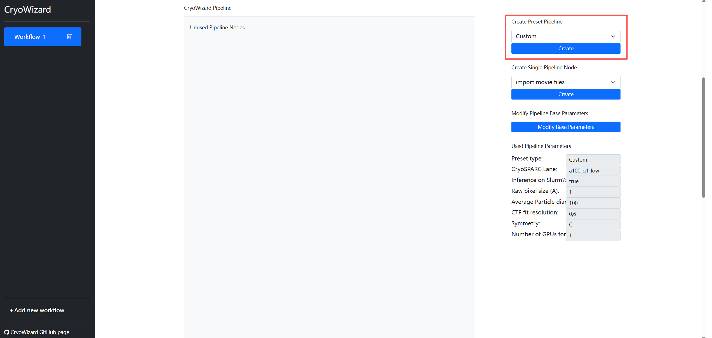
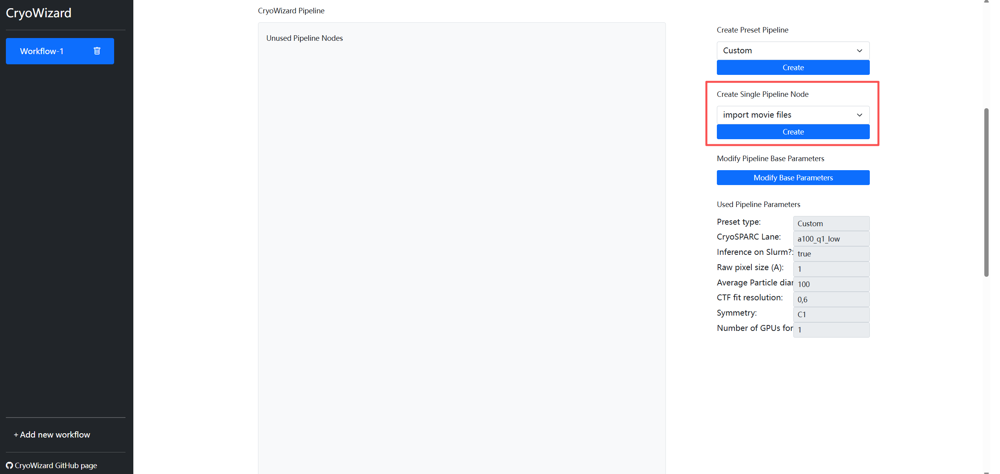
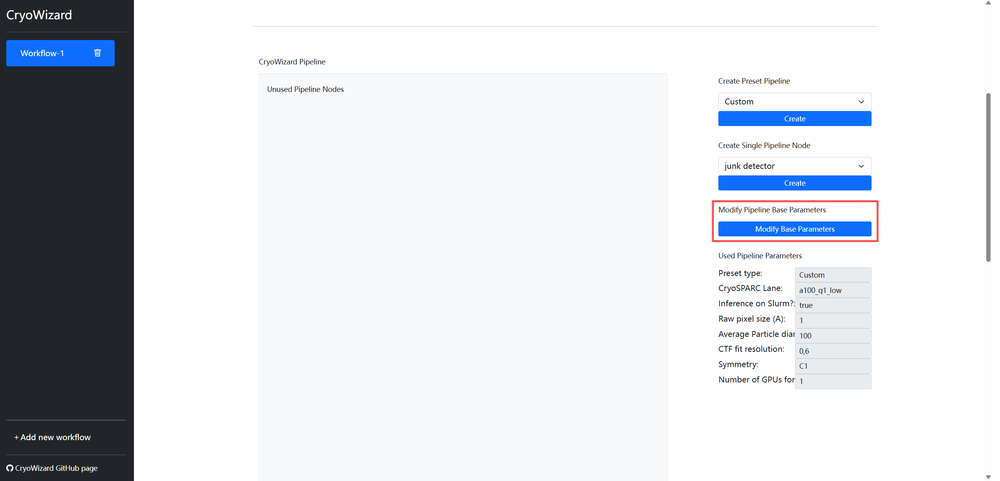
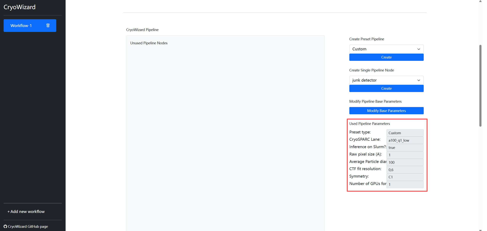
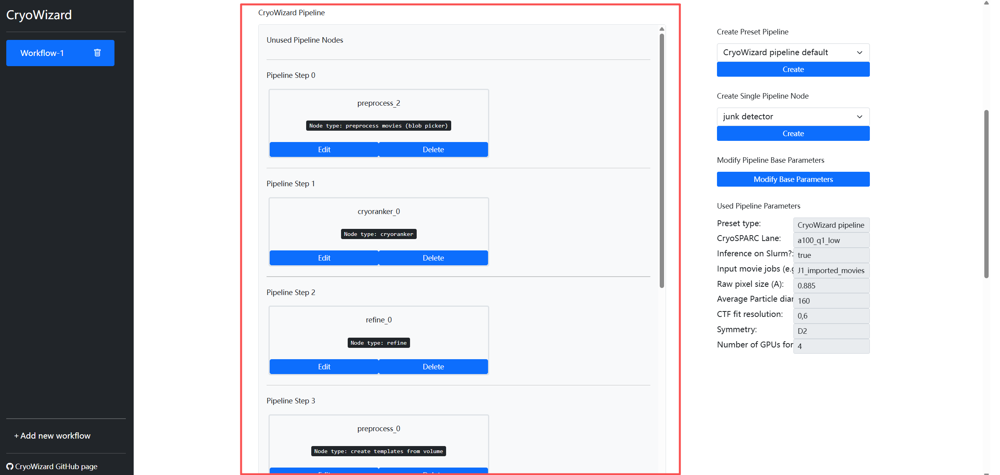

# Use CryoWizard via Web Interface

## Pipeline Settings
   
### Create Preset Pipeline

The `Create Preset Pipeline` section is used to generate complete, pre-configured pipelines. This will automatically create multiple pipeline nodes and interconnect them seamlessly.

**Preset pipeline type**:

- **Cryowizard pipeline default**: Standard pipeline. It begins with an initial round of particle picking using a Blob Picker, followed by CryoRanker and a few rounds of NU-Refinement to generate a 3D volume. Subsequently, if the input includes movies or micrographs, the pipeline will automatically perform Template Picking on them using the initial 3D volume. All resulting particles then undergo another round of CryoRanker and NU-Refinement to produce a new 3D volume, followed by post-processing for the final result.
- **Cryowizard pipeline simpler**: A streamlined version that only performs a single round of particle picking using the Blob Picker, followed by CryoRanker, NU-Refinement, and post-processing to obtain the final 3D volume.
- **Cryoranker only**: The pipeline only executes pre-processing and CryoRanker, skipping all subsequent refinement steps.
- **Cryoranker get top particles**: Requires an existing CryoRanker job as input. This mode filters particles based on CryoRanker scores, allowing you to select particles above a specific threshold or extract a fixed number of high-quality particles sorted by score.
- **Custom**: A non-preset mode that performs no automated actions.

### Create Single Pipeline Node

The `Create Single Pipeline Node` section allows you to create an individual pipeline node. Once created, you can modify its parameters in the Pipeline section on the left.

**Pipeline nodes type**:

- **import movie files**: Import movie files, output types: movie
- **import micrograph files**: Import micrograph files, output types: micrograph
- **import particle files**: Import particle files, output types: particle
- **import volume file**: Import single volume/mask file, output types: volume/mask
- **preprocess movies (blob picker)**: Preprocess movie jobs to particles with blob picker, output types: movie, micrograph, particle, template
- **preprocess movies (template picker)**: Preprocess movie jobs to particles with template picker, output types: movie, micrograph, particle, template
- **preprocess micrographs (blob picker)**: Preprocess micrograph jobs to particles with blob picker, output types: micrograph, particle, template
- **preprocess micrographs (template picker)**: Preprocess micrograph jobs to particles with template picker, output types: micrograph, particle, template
- **preprocess particles**: Preprocess particles, output types: particle
- **create templates from volume**: Create templates from single volume, if multiple volumes exsit in the input, it will use the first one, output types: template
- **reference based auto select 2D**: (**Need CryoSPARC version 4.7+**) Doing 2D Classification and use reference volume to select classes, if multiple volumes exsit in the input, it will use the first one, output types: particle, template, volume
- **junk detector**: (**Need CryoSPARC version 4.7+**) Use CryoSPARC junk detector to delete particles, these particles should have picking info, output type: micrograph, particle
- **cryoranker**: Create CryoRanker inference job, output types: particle, ranker
- **cryoranker get top particles**: Get top particles from CryoRanker jobs, output types: particle, ranker
- **refine**: Use CryoRanker jobs to run multiple refine jobs, for finding best number of particles to get final 3D volume, output types: particle, volume, mask
- **motion and ctf refine**: Do motion refine and global/local ctf refine, output types: particle, volume, mask

### Modify Pipeline Base Parameters

The `Modify Pipeline Base Parameters` section is used to adjust the fundamental settings of the pipeline, such as toggling whether to use Slurm for model inference.

### Used Pipeline Parameters

The `Used Pipeline Parameters` section displays the settings configured during the Create Preset Pipeline process. This is a display-only area and does not support direct input.

> **Caution**: This section only reflects parameters modified within the `Create Preset Pipeline` section; changes made in other sections will not be shown here.

### CryoWizard Pipeline Panel

The `CryoWizard Pipeline` panel displays the entire pipeline, including both active nodes currently in the pipeline and unused nodes. You can click the `Edit` button on any node to modify its parameters, or `Delete` to remove it. Every time a node is added, modified, or deleted, CryoWizard automatically recalculates and reconstructs the pipeline flowchart in real-time.

**Parameters list**:

- **CryoSPARC Lane**: Which CryoSPARC lane to queue CryoSPARC jobs during running.
- **Inference on Slurm?**: Whether run model inference on Slurm or not, set this parameter to `true`/`True`/`yes`/`Yes`/`y`/`Y` to enable the option or set it to `false`/`False`/`no`/`No`/`n`/`N` to disable it.
- **Inference GPU ids**: If model inference (e.g., CryoRanker) is running locally rather than being submitted via Slurm, you can use this parameter to specify which GPUs to use. For example, entering `0,1` will allocate GPU 0 and GPU 1.
- **Input movie jobs (e.g. J1 J2)**: Input movie jobs id, multiple Job IDs should be space-separated.
- **Input micrograph jobs (e.g. J1 J2)**: Input micrograph jobs id, multiple Job IDs should be space-separated.
- **Input particle jobs (e.g. J1 J2)**: Input particle jobs id, multiple Job IDs should be space-separated.
- **Input template jobs (e.g. J1 J2)**: Input template jobs id, multiple Job IDs should be space-separated.
- **Input volume jobs (e.g. J1 J2)**: Input volume jobs id, multiple Job IDs should be space-separated.
- **Input mask jobs (e.g. J1 J2)**: Input mask jobs id, multiple Job IDs should be space-separated.
- **Input cryoranker jobs (e.g. J1 J2)**: Input CryoRanker jobs id, multiple Job IDs should be space-separated.
- **Movies data path**: Movie files data path
- **Gain reference path**: Gain reference file data path
- **Micrographs data path**: Micrograph files data path
- **Particle data path**: Particle files data path
- **Particle meta path**: Particle metadata files path
- **Volume data path**: Volume file data path
- **Volume EMDB Id**: Volume EMDB Id
- **Volume import type**: map/map_sharp/mask
- **Volume pixel size (A)**: Volume pixel size
- **Accelerating Voltage (kV)**: Accelerating Voltage
- **Spherical Aberration (mm)**: Spherical Aberration
- **Total exposure dose (e/A^2)**: Total exposure dose
- **Raw pixel size (A)**: Raw pixel size
- **Average Particle diameter (A)**: Average Particle diameter
- **CTF fit resolution**: CTF fit resolution
- **Symmetry**: Protein symmetry
- **Number of GPUs for Multi-GPU CryoSPARC jobs**: Number of GPUs for Multi-GPU CryoSPARC jobs
- **Get top particles number**: If want get top particles by particle number, set this parameter
- **Get top particles score**: If want get top particles by particle min score, set this parameter (Score range: 0-1)

> **Caution**: Generally, you only need to enter the CryoSPARC Job ID in the jobs input field. CryoWizard will automatically identify the best matching output from that job to use as its input. However, if the job contains multiple similar outputs (for example, a "Particle Sets Tool" job may have split 0, split 1, etc.), CryoWizard might fetch the incorrect one due to ambiguity. In such cases, we recommend using the format "Job ID + underscore + target output group name" (e.g., J1_imported_movies, as shown in the figure above). You can find the specific output group name in the Output Groups section of the CryoSPARC job (as shown in the figure below). Additionally, we support specifying inputs by the pipeline block name (e.g., preprocess_0). However, you must ensure that the referenced pipeline block generates an output of the corresponding type.
   

