# CryoWizard Quick Start

## Launch CryoWizard server

Once the installation is complete, you can launch the CryoWizard GUI backend with a single command:

    (cryowizard) $ cd path/to/CryoWizard
    (cryowizard) $ python CryoWizard.py \
        --CryoWizardGUI \
        --cryowizard_gui_port 39080

The `--cryowizard_gui_port` parameter specifies the port used to connect the CryoWizard backend service to the frontend. If this parameter is omitted, the service will use the default port defined in `path/to/CryoWizard/CryoWizard/cryowizard_settings.yml`.

Upon a successful launch, the following message will be displayed:

    Web service start, press Ctrl+C to quit if you want to stop this web service. (GUI port: 39080)

Once the CryoWizard backend is running, we recommend two primary ways to use the software:

- **Via Chrome Extension**: This is the simplest method and aligns perfectly with your existing CryoSPARC workflow. In this mode, CryoWizard appears directly in the CryoSPARC job list as a creatable job type, allowing you to interact with it just like any standard CryoSPARC job.

- **Via Web Interface**: CryoWizard also provides a standalone web interface. Unlike the Chrome extension, the web UI offers greater flexibility, allowing you to fully customize pipeline components and fine-tune parameters for each module. This is ideal for power users who require deeper control over their processing. For full usage instructions, please refer to the Documentation.

## Use CryoWizard via Chrome Extension

### Step 1: Install CryoWizard chrome extension

This extension is for the Google Chrome browser. If you do not have Chrome, you can download it from the [Chrome official website](https://www.google.com/chrome/).

1. Copy the `extension.zip` file to your own computer and unzip it, which is located in `path/to/CryoWizard/extension.zip`. This will create a folder named `extension`.

   > **Caution**: You need to complete the `python CryoWizard.py --CryoWizardInstall ...` process first, and then the `extension.zip` file will exist in this directory. See CryoWizard Installation, step 3.

2. Open Chrome and navigate to `Settings -> Extensions -> Manage Extensions`

   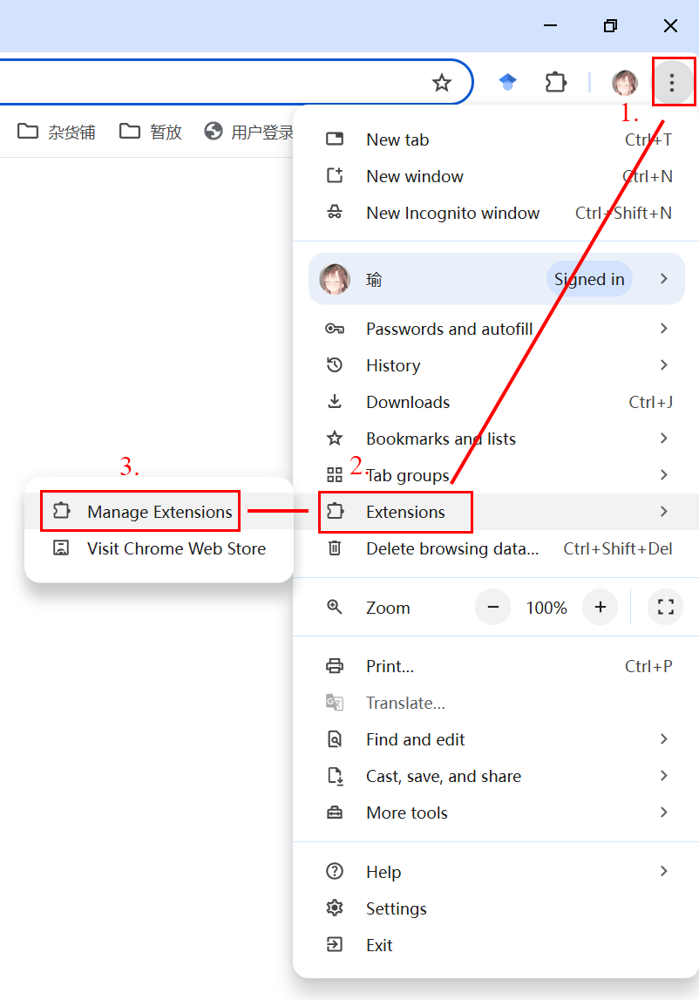

3. Turn on `Developer mode` in the top-right corner. 

   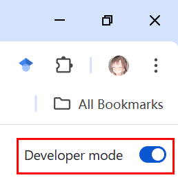
4. Click `Load Unpacked`
   
   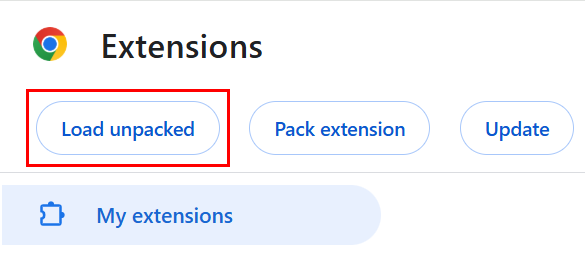

5. Select the `extension` folder you created in the first step.

   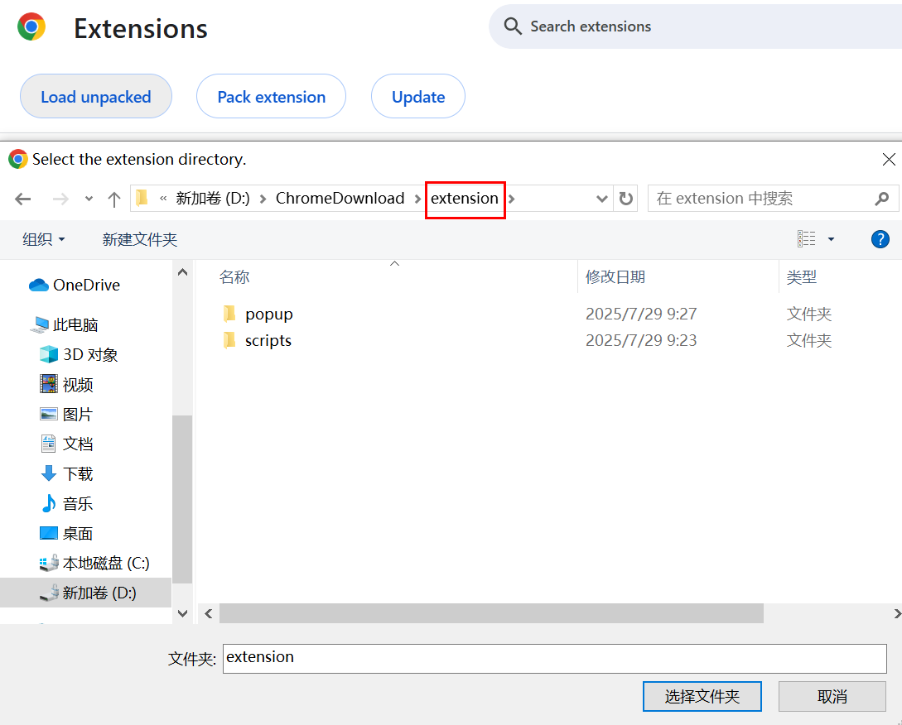

   The CryoWizard Chrome extension is now installed. Before proceeding, ensure it is activated (toggled on) in the extensions list.

   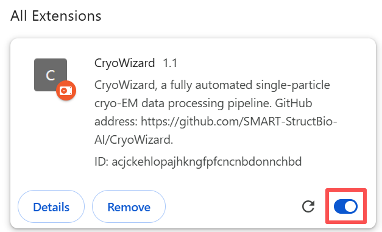

### Step 2: Launch CryoWizard Chrome Extension

1. In the Chrome toolbar, click the `Extensions` icon and select `CryoWizard`

   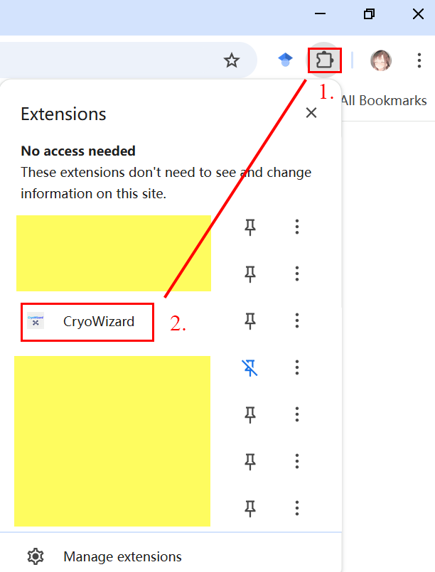

2. In the pop-up window, enter the server address (`http//:[server_address]:[port]`) of your CryoWizard backend server, and enter the same username and password you use to log in to CryoSPARC.

   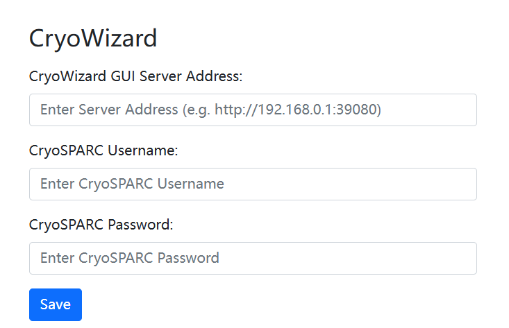

3. Log in to your CryoSPARC account and navigate to any project workspace. **Refresh your web page**, the `CryoWizard` button  will now appear in the job builder interface. **The CryoWizard button will only appear within a workspace**.
   
   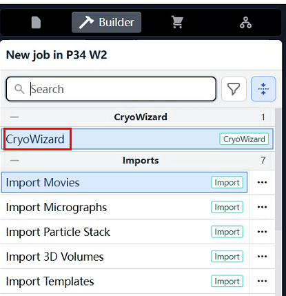

### Step 3: Create CryoWizard Pipeline

1. Just like creating a standard CryoSPARC job, click the newly appeared `CryoWizard` button to create a new CryoWizard job.

   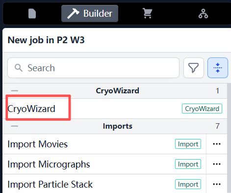

2. A new CryoWizard job will now appear in your workspace. Click the `Build` button to enter the building interface.

   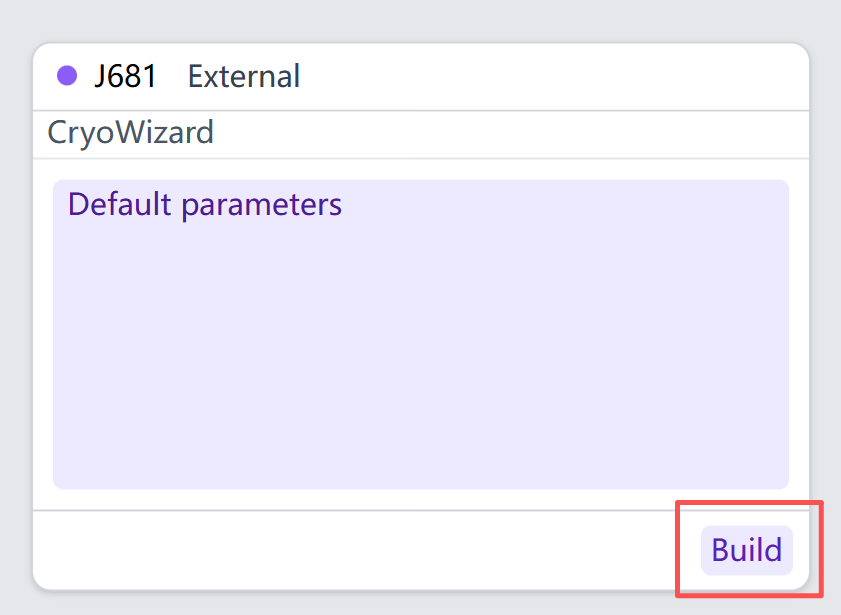

3. In the CryoWizard job building interface, simply link your inputs and fill in the parameters as you would for a standard CryoSPARC job. Then, click the `Queue Job` button. After a few seconds, the CryoWizard job will automatically begin its execution.

   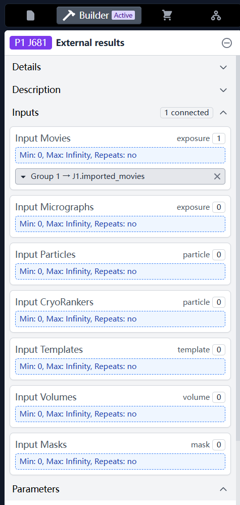

   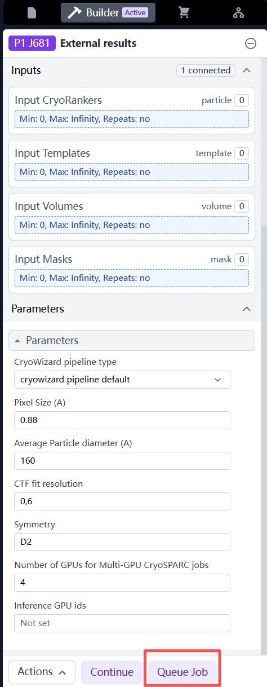

4. CryoWizard may take some time to complete its processing. During this period, you can enter the CryoWizard job to monitor the Event Log. Once the task is finished, your final 3D volume results will be available for download directly from the Output Groups section of the job.

   

5. If you need to stop the process while CryoWizard is running, simply click `Kill Job` as you would for any standard CryoSPARC job. CryoWizard and all its associated child jobs will automatically terminate.

   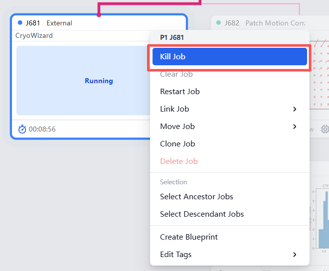

6. To resume a stopped job, simply navigate to the Details page and click `Continue`. Within seconds, CryoWizard will automatically pick up from the last recorded step.

   > **Caution**: Do **NOT** click the `Restart Job` button of CryoWizard job, as it will permanently delete all data associated with this job. To resume the pipeline, please use the `Continue` button instead.
   
   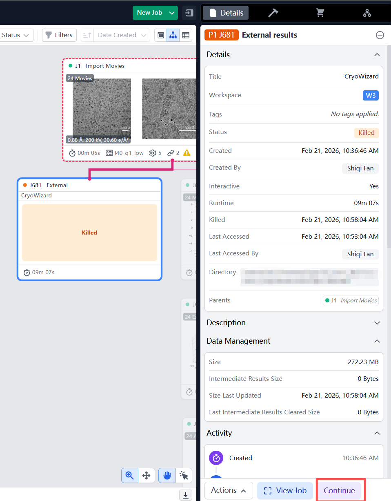

## Use CryoWizard via Web Interface

1. Since we started CryoWizard server at first, just access the web interface at `http//:[server_address]:[port]`. You can add a new workflow by clicking the `Add new workflow` button, or remove one by clicking the delete button. Each workflow is designed to manage a single CryoWizard job.

   > **Note**: Deleting a workflow or closing the browser tab will not affect any CryoWizard jobs that have already been created or are currently running.

   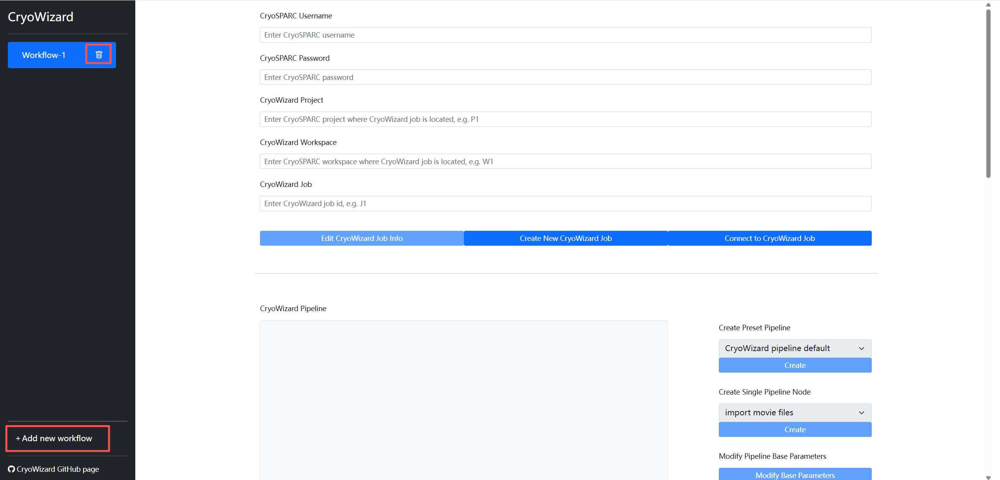

2. In the first section of the workflow, enter your CryoSPARC login credentials (username and password), along with the Project ID and Workspace ID where you want the CryoWizard job and its child jobs to reside.

   - **To Create a New Job**: Leave the "CryoWizard Job" field empty and click the `Create New CryoWizard Job` button. CryoWizard will automatically create a new job and populate its ID into the field. Then, click `Connect to CryoWizard Job` to proceed.

   - **To Open an Existing Job**: Simply enter the existing Job ID into the "CryoWizard Job" field and click the `Connect to CryoWizard Job` button.

   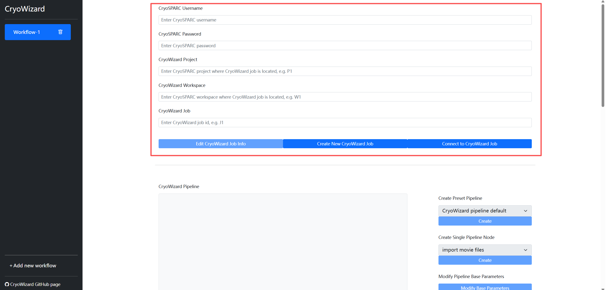

3. After successfully connecting to the CryoWizard job, navigate to the `Create Preset Pipeline` section on the right. Select your desired pipeline type—we recommend "CryoWizard pipeline default"—and click the `Create` button.
   
   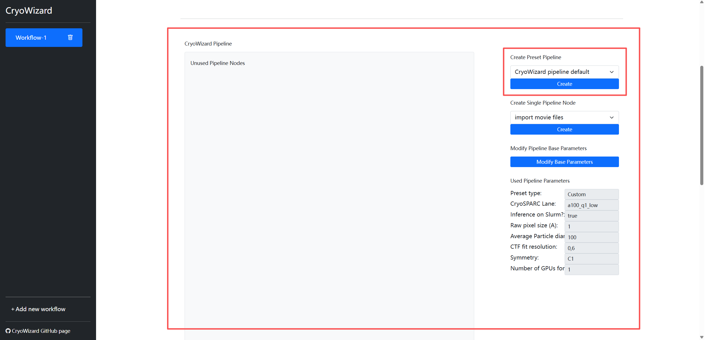
   
   A configuration window will appear. The pipeline supports Movie, Micrograph, or Particle data as inputs. You can provide these either by entering a Job ID or by specifying file paths and parameters (similar to CryoSPARC's import jobs). You may input one or multiple types simultaneously, provided that the pixel size and box size are consistent across all inputs. For this guide, we will use an existing Movie job as our example input. After modifying parameters, click `Create Pipeline` button

   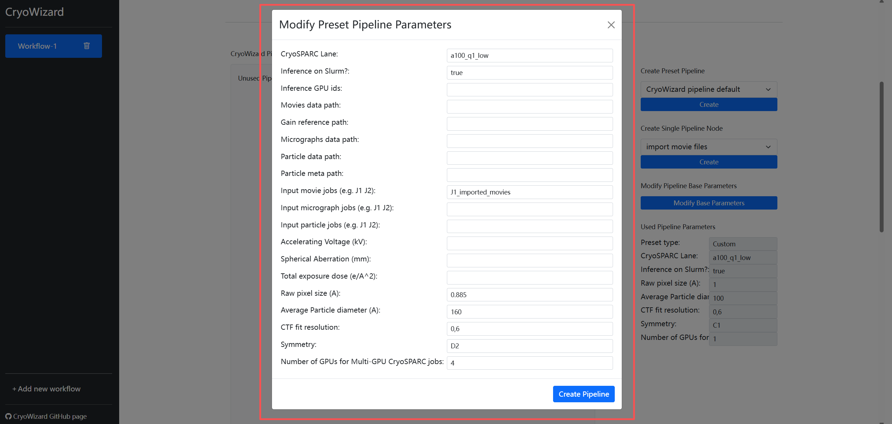

   > **Caution**: Generally, you only need to enter the CryoSPARC Job ID in the jobs input field. CryoWizard will automatically identify the best matching output from that job to use as its input. However, if the job contains multiple similar outputs (for example, a "Particle Sets Tool" job may have split 0, split 1, etc.), CryoWizard might fetch the incorrect one due to ambiguity. In such cases, we recommend using the format "Job ID + underscore + target output group name" (e.g., J1_imported_movies, as shown in the figure above). You can find the specific output group name in the Output Groups section of the CryoSPARC job (as shown in the figure below). Additionally, we support specifying inputs by the pipeline block name (e.g., preprocess_0). However, you must ensure that the referenced pipeline block generates an output of the corresponding type.
   
   

   After a pipeline has been created, click `Save CryoWizard Pipeline`.
   
   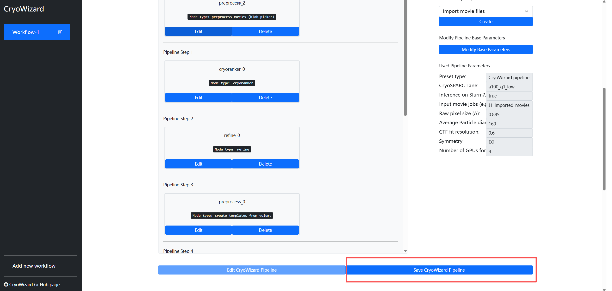

4. Now, click the `Run` button (please avoid clicking it multiple times). The CryoWizard pipeline will start within a few seconds. The execution logs will be displayed in the `Output Panel` and synchronized in real-time within the CryoWizard job on the CryoSPARC interface. At this stage, deleting the workflow or closing the webpage will not affect the execution.

   Once complete, click `Download Map` to download the final 3D volume. If you need to stop the process, click `Kill`. To resume from a paused state, click `Continue`. To reset the process without deleting the pipeline itself, click Clear (this will only remove the generated metadata during running).

   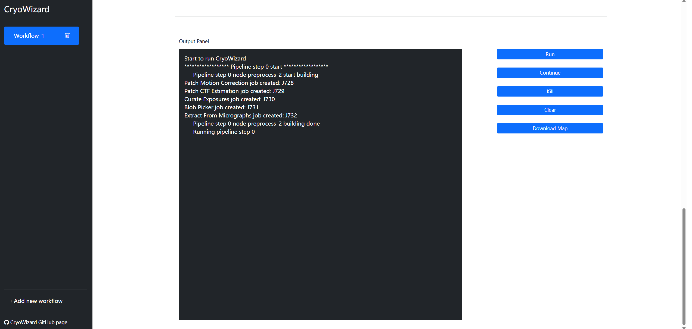

## Test Case

This test case demonstrates the application of CryoWizard using the beta-galactosidase dataset, a small, widely-used dataset frequently featured in [RELION tutorials](https://relion.readthedocs.io/en/release-4.0/SPA_tutorial/Introduction.html). Movie data for this dataset can be downloaded from the relion tutorial 

1. CryoWizard parameters set:

   - CryoWizard pipeline type: cryowizard pipeline default
   - Pixel Size (A): 0.88
   - Average Particle diameter (A): 160
   - CTF fit resolution: 0,6
   - Symmetry: D2
   - Number of GPUs for Multi-GPU CryoSPARC jobs: 4
   - Inference GPU ids: (empty)

2. Results:
   
   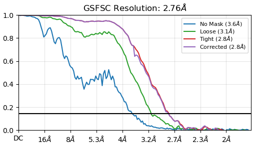

   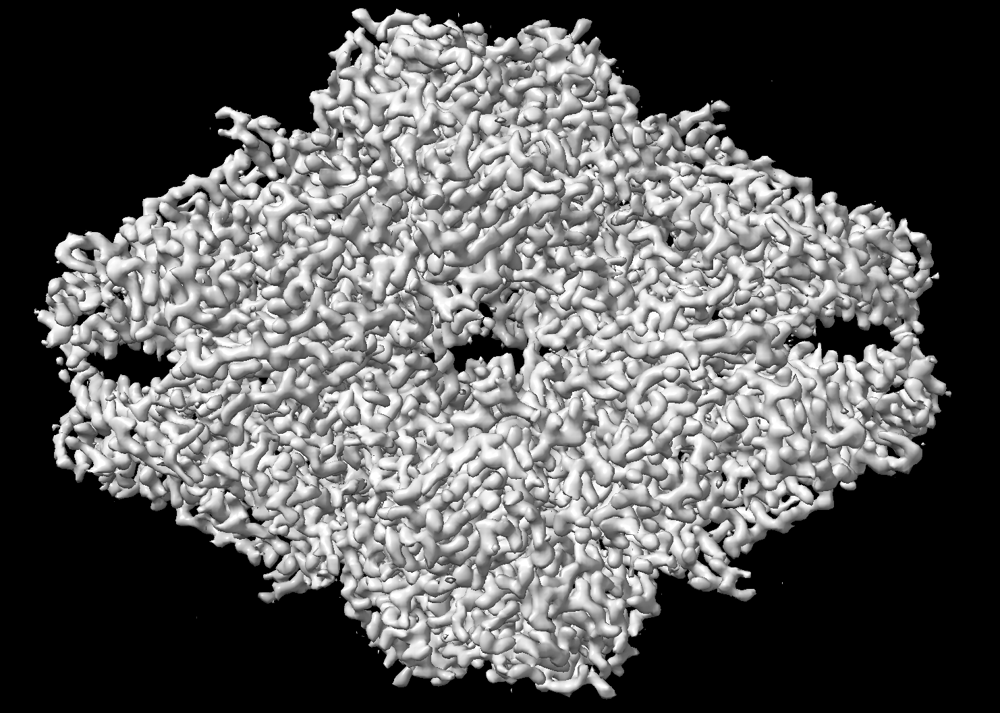   

